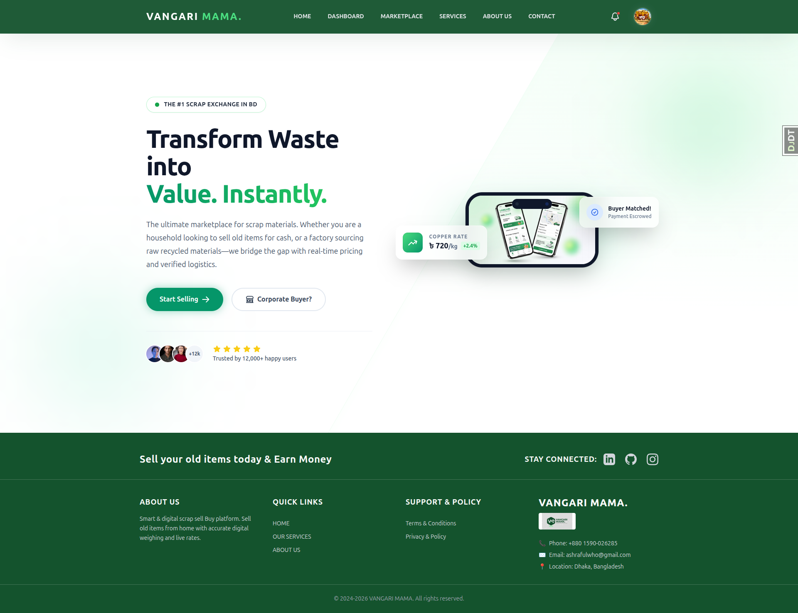
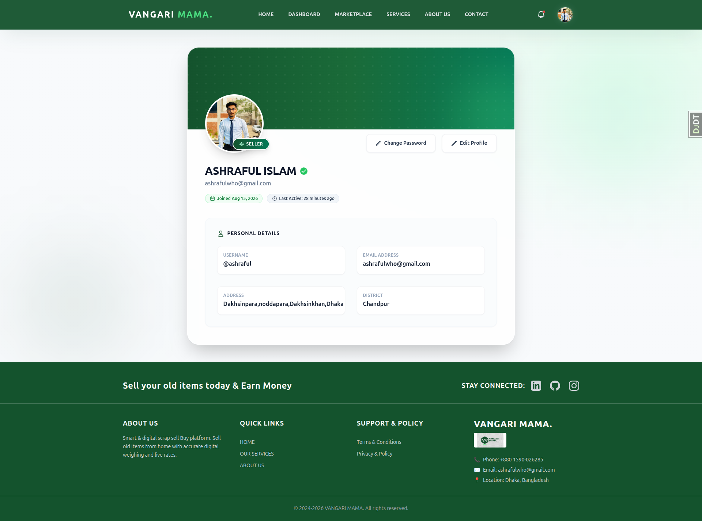

# Vangari Mama

A Django-based online marketplace for buying and selling scrap and recyclable materials, with price negotiation, order management, and role-based dashboards.

## Live Demo

🔗 [https://vangari-mama.onrender.com](https://vangari-mama.onrender.com)

## Screenshots

| Home | Profile View |
|---|---|
|  |  |

| Dashboard | Offers |
|---|---|
|  |  |

## Features

### Authentication & Users
- Custom user model with role-based accounts — Buyer, Seller, and Admin
- Sign up with email activation link
- Sign in with email or username
- Google OAuth login (django-allauth)
- Password reset via email and in-app password change
- Editable profile — bio, address, district, phone number, profile picture

### Marketplace & Listings
- Sellers can create and edit listings (title, description, price, quantity, category, image)
- Admin-managed categories
- Public marketplace with search and category filtering
- Paginated listing feed
- Listing detail page with total price calculation and seller contact info
- Listing status tracking (Available / Sold Out)

### Bidding & Offers
- Buyers can submit custom price offers on listings
- Sellers can review, accept, or reject incoming offers
- Buyers can track the status of their submitted offers
- Sellers can view all offers received across their listings

### Orders
- Direct purchase flow with automatic order creation
- Platform commission automatically calculated on every completed order
- Order detail view restricted to the buyer and seller involved
- Paginated order history for both buyers and sellers

### Dashboards
- **Admin** — all users, listings, categories, offers, orders, and connected social accounts
- **Seller** — own listings and sales activity
- **Buyer** — recent purchases

### Notifications
- In-app notifications for offer acceptance/rejection
- Paginated notification list
- Mark-as-read on open, with redirect to the related page

### Ratings & Reviews
- Buyers and sellers can rate and review each other after a completed transaction
- Review text is optional

### Other
- Static pages — Home, About Us, Contact Us, Services
- Custom 404 and permission-denied error pages
- Responsive UI built with Tailwind CSS

## Tech Stack

| Category | Technology |
|---|---|
| Backend | Python, Django |
| Database | PostgreSQL |
| Authentication | django-allauth (Google OAuth), Django Auth |
| Frontend | Django Templates, Tailwind CSS |
| Media | Pillow |
| Other | django-phonenumber-field, python-decouple |

## Project Structure

```
vangari_mama/
├── core/            → Home, About, Contact, Services, error pages
├── users/           → Custom user model, auth, roles, dashboards, profile
├── listings/        → Categories and marketplace listings
├── bids/            → Offer and negotiation system
├── orders/          → Purchases and commission handling
├── notifications/   → In-app notifications
├── reviews/         → Post-transaction ratings and reviews
└── vangari_mama/    → Project settings and root URLs
```

## Getting Started

### Prerequisites
- Python 3.12+
- PostgreSQL
- Node.js and npm

### Installation

1. Clone the repository
```
git clone https://github.com/ashrafulx/vangari-mama.git
cd vangari-mama
```

2. Create and activate a virtual environment
```
python -m venv venv
source venv/bin/activate
```

3. Install Python dependencies
```
pip install -r requirements.txt
```

4. Install frontend dependencies
```
npm install
```

5. Create a `.env` file in the project root
```
SECRET_KEY=
DEBUG=

DB_NAME=
DB_USER=
DB_PASSWORD=
DB_HOST=
DB_PORT=

EMAIL_BACKEND=
EMAIL_HOST=
EMAIL_USE_TLS=
EMAIL_PORT=
EMAIL_HOST_USER=
EMAIL_HOST_PASSWORD=

FRONTEND_URL=
BACKEND_URL=
```

6. Apply migrations
```
python manage.py migrate
```

7. Build Tailwind CSS
```
npm run build:tailwind
```

8. Run the development server
```
python manage.py runserver
```

The app will be available at `http://127.0.0.1:8000`

## User Roles

| Role | Access |
|---|---|
| Buyer | Browse marketplace, make offers, purchase listings, view orders |
| Seller | Create/manage listings, review offers, view sales |
| Admin | Manage categories, users, and monitor all activity |

## License

This project is licensed under the MIT License — see the [LICENSE](LICENSE) file for details.

## Author

**Ashraful Islam**
GitHub: [@ashrafulx](https://github.com/ashrafulx)